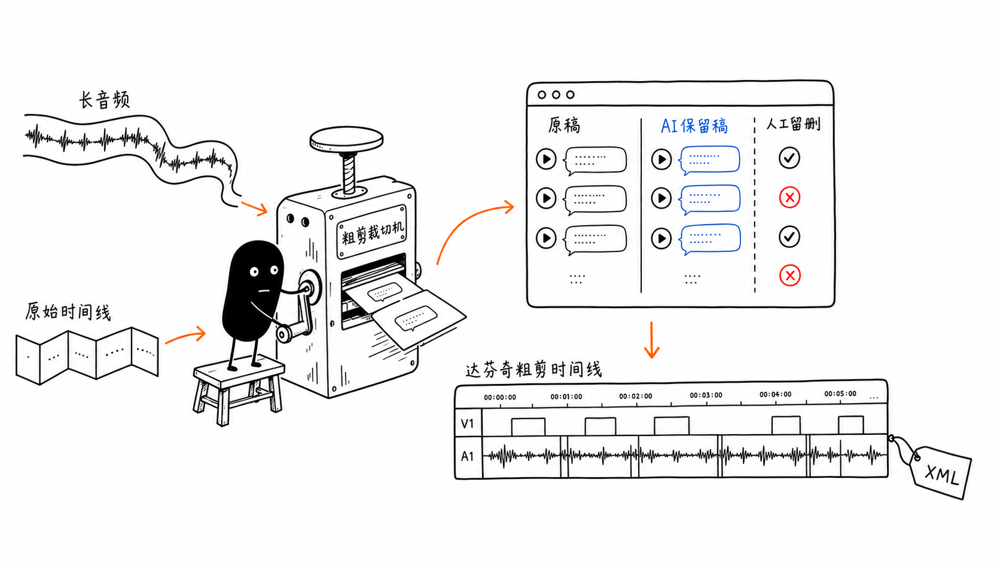
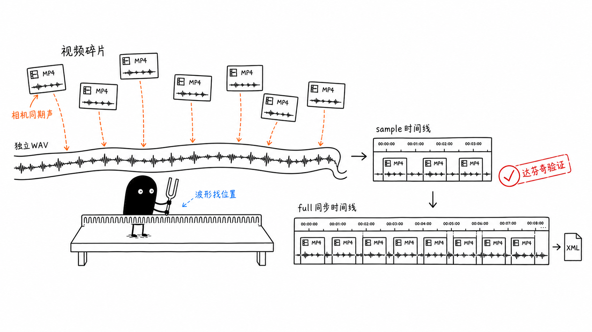

# DaVinci Rough Cut Skill

中文说明见 [README.zh.md](README.zh.md).

DaVinci Rough Cut is a local Agent skill for DaVinci Resolve rough-cut workflows. It helps editors turn long footage, multi-clip spoken material, podcasts, documentary footage, or other speech-heavy source material into reviewable transcript decisions and Resolve-importable rough-cut timelines.

It does not make the final edit for you. It focuses on two repetitive pre-editing jobs:

1. **Transcript-guided rough cut**: transcribe timeline audio, ask an LLM to suggest keep/delete decisions, review those decisions in a local browser panel, then export a Resolve rough-cut timeline.
2. **Audio-video alignment**: align fragmented camera MP4 clips to a continuous external recorder WAV, verify a small sample timeline in Resolve, then export a full synchronized timeline.

## Core Workflows

### 1. Transcript-Guided Rough Cut

Inputs:

- `audio.wav` / `audio.mp3`: audio exported from the original Resolve timeline
- `reference.xml`: FCP 7 XML exported from that same Resolve timeline
- optional `context.md`: editing brief, audience, must-keep moments, target length

Flow:

1. Volcengine ASR fast mode transcribes the local audio into `transcript.json`.
2. An LLM marks suggested keep/delete decisions in `edited.json`.
3. The local review panel shows original transcript, AI keep suggestions, playback, and manual keep/delete controls.
4. The panel exports a Resolve-importable rough-cut timeline XML.



### 2. Audio-Video Alignment

Inputs:

- camera MP4 directory, where each clip has camera scratch audio
- external recorder WAV directory, usually continuous audio from a mic/recorder
- `matches.csv`: each MP4 clip's matched position on the WAV timeline
- `timecodes.csv`: source timecode for each MP4

Flow:

1. Generate a small `sample XML`.
2. Import the sample into Resolve and verify sync plus media linking.
3. Generate the full synchronized timeline only after the sample passes.

This workflow does not require ASR or an LLM if your match/timecode CSVs are ready.



## First-Time Install

If the skill is not installed yet, send this prompt to Codex, Claude Code, NewMax, or another terminal-capable Agent:

```text
Install the DaVinci Rough Cut skill from this repository:
https://github.com/erek303/davinci-rough-cut-skill

Requirements:
1. git clone the repository.
2. Install the skill into the skill directory actually used by this Agent. Do not default to Codex paths.
3. If you know your skill root, run: bash install.sh --target "<your-agent-skill-root>"
4. If you do not know your skill root, run: bash install.sh --target auto
5. Create the Python venv inside the davinci-rough-cut directory printed by the installer.
6. Install requirements-core.txt into that venv.
7. Check that ffmpeg and ffprobe are available.
8. Do not read, print, commit, or upload real API keys. Do not ask me to paste real keys into chat.
9. Tell me the final install path, current commit, and which ASR / LLM environment variables are still missing.
```

Manual terminal install:

```bash
git clone https://github.com/erek303/davinci-rough-cut-skill.git
cd davinci-rough-cut-skill
bash install.sh --target auto
```

Then create the venv in the installed directory printed by `install.sh`:

```bash
cd /path/printed/by/install.sh/davinci-rough-cut
python3 -m venv .venv
.venv/bin/python -m pip install -U pip
.venv/bin/python -m pip install -r requirements-core.txt
```

Install is a first-time setup action. After the skill is installed, use the commands below; do not keep routing normal use through an install command.

## Commands After Install

Use these with the Agent where this skill is already installed:

```text
/davinci-rough-cut
```

Default router. The Agent should choose the right workflow from your files and goal.

```text
/davinci-rough-cut rough-cut
```

Run transcript-guided rough cut: Resolve audio + reference XML -> ASR -> AI keep/delete suggestions -> mandatory browser review panel -> Resolve rough-cut timeline.

```text
/davinci-rough-cut align
```

Run audio-video alignment: `matches.csv` + `timecodes.csv` + camera MP4 + external WAV -> sample XML -> Resolve verification -> full XML.

```text
/davinci-rough-cut update
```

Update the installed skill without asking the user to paste the GitHub URL again.

If the stable launcher is on `PATH`, you can also run:

```bash
davinci-rough-cut-update
```

## Configure Keys

There are two separate key categories:

- **ASR key**: transcribes audio to timestamped text.
- **LLM key**: decides which transcript segments should be kept or deleted.

### A. ASR: Volcengine

The recommended default is Volcengine audio-file fast mode. It sends local audio data directly to the ASR API, so ordinary users do not need TOS object storage or a private bucket.

Minimum setup:

```bash
export VOLCENGINE_API_KEY="your-volcengine-api-key"
```

Legacy consoles may provide App ID + Access Token instead:

```bash
export VOLCENGINE_APP_ID="your-volcengine-app-id"
export VOLCENGINE_ACCESS_TOKEN="your-volcengine-access-token"
```

Suggested setup path:

1. Open the Volcengine console.
2. Enable the audio-file fast ASR / bigmodel recording-file recognition capability.
3. Create or copy the ASR API Key.
4. Set `VOLCENGINE_API_KEY` locally.
5. Test with 1-2 minutes of audio before processing a full project.

Only use the older URL/TOS path if you explicitly need it:

```bash
export VOLCENGINE_ASR_MODE="standard-url"
export VOLCENGINE_ACCESS_KEY="your-volcengine-iam-access-key"
export VOLCENGINE_SECRET_KEY="your-volcengine-iam-secret-key"
export VOLCENGINE_TOS_BUCKET="your-tos-bucket"
export VOLCENGINE_TOS_REGION="cn-shanghai"
```

### B. LLM: Keep/Delete Decisions

Configure at least one:

```bash
export GLM_API_KEY="your-glm-api-key"
export DEEPSEEK_API_KEY="your-deepseek-api-key"
export MIMO_API_KEY="your-xiaomi-mimo-api-key"
# or export XIAOMI_API_KEY="your-xiaomi-mimo-api-key"
export ANTHROPIC_API_KEY="your-anthropic-api-key"
```

Optionally force one backend:

```bash
export AI_EDIT_BACKEND="deepseek"  # glm / deepseek / mimo / anthropic
```

Common model settings:

```bash
export DEEPSEEK_MODEL="deepseek-v4-flash"
export MIMO_BASE_URL="https://token-plan-cn.xiaomimimo.com/v1"
export MIMO_MODEL="mimo-v2.5-pro"
```

Xiaomi MiMo `mimo-v2.5-asr` is available for short-audio experiments, but the recommended long-form rough-cut ASR path is Volcengine fast mode.

## Input Contract For Transcript-Guided Rough Cut

A raw source-media folder by itself is not enough. First export two files from DaVinci Resolve:

- `audio.wav` or `audio.mp3`: audio from the original Resolve timeline
- `reference.xml`: FCP 7 XML from the same timeline

ASR only knows what was said at each timestamp. It does not know which original video file that timestamp came from. `reference.xml` maps transcript timestamps back to source clips, so the exported rough-cut timeline can reference the original media correctly.

Agent prompt example:

```text
/davinci-rough-cut rough-cut

Please make a transcript-guided rough cut.
Audio: /path/to/my-project/audio.wav
DaVinci reference XML: /path/to/my-project/reference.xml
Context: /path/to/my-project/context.md
Work dir: /path/to/my-project/work
FPS: 50
Goal: keep the most useful material and export a Resolve-importable rough-cut timeline.
```

## Mandatory Review Panel Rule

For transcript-guided rough cuts, the browser review panel is part of the core workflow.

After ASR and AI keep/delete decisions finish, the Agent must start `web_editor.py`, give the user the local URL, and let the user review before exporting the final DaVinci XML.

Normal local URL:

```text
http://localhost:5001
```

Do not jump directly from `transcript.json` / `edited.json` to `rough_cut.xml` unless the user explicitly asks to skip manual review. If the panel does not open, report the exact command and error instead of silently generating XML.

## Manual Run Example

```bash
SKILL="${DAVINCI_ROUGH_CUT_SKILL_DIR:-/path/to/installed/davinci-rough-cut}"
PY="$SKILL/.venv/bin/python"

"$PY" "$SKILL/scripts/volcengine_asr.py" \
  /path/to/my-project/audio.wav \
  -o /path/to/my-project/work/transcript.json

"$PY" "$SKILL/scripts/ai_edit_transcript.py" \
  /path/to/my-project/work/transcript.json \
  -o /path/to/my-project/work/edited.json \
  --context /path/to/my-project/context.md

"$PY" "$SKILL/scripts/web_editor.py" \
  --transcript /path/to/my-project/work/transcript.json \
  --edited /path/to/my-project/work/edited.json \
  --audio /path/to/my-project/audio.wav \
  --davinci-ref /path/to/my-project/reference.xml \
  --fps 50 \
  --port 5001
```

Open `http://localhost:5001`, review keep/delete decisions, then export the DaVinci XML from the panel.

## Safety

The public repository does not include real API keys, hosted accounts, local media, transcript intermediates, or private project files. Keep real keys in your local environment variables, shell profile, system keychain, or an uncommitted `.env`. Do not paste real keys into chat and do not commit them to GitHub.

Use `.env.example` only as a placeholder reference:

```bash
cp .env.example .env
```

The scripts do not automatically load `.env`. To load it in the current terminal session:

```bash
set -a
source .env
set +a
```

## Documentation

- [中文快速上手](docs/quickstart.zh.md)
- [Complete user manual](docs/user-manual.md)
- [Example editor context](examples/context.example.md)
- Agent-facing skill entry: [skill/davinci-rough-cut/SKILL.md](skill/davinci-rough-cut/SKILL.md)

## Offline Validation

```bash
python3 tests/test_offline_workflows.py
```
